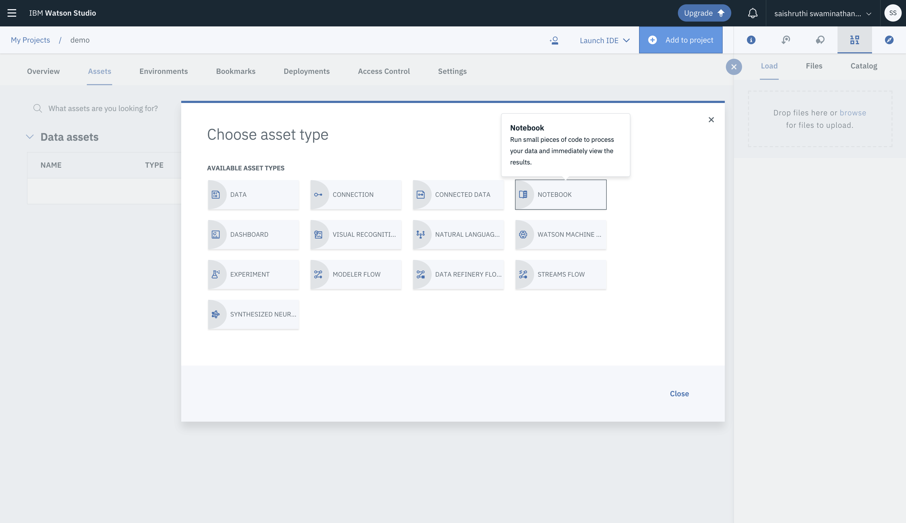

# women_who_code_part_2

## Getting Started

1. Sign-up in IBM cloud using the link posted on meetup. https://ibm.biz/Bd2XTr
2. Add `Machine Learning` service.

    * Click on `Create` in the Resource Summary panel
    * In `AI`, select `Machine Learning`.
          
    
    
    

3. Create ML instance
    * Specify the `Service Name` and the `Region`
    * Scroll down to Pricing Plans and make sure to select the `Lite plan`.
    * Click `Create`
    * Click on `Access in Watson Studio`
    * Wait for the platform to load, and click `Get Started` to continue
    
    
    
    

4. Create the Project
    * Click on `Create Project`.
    * Choose `Data Science` and provide project details. Press `Create` to continue.
    
    
    
    
    
    

5. Add the Notebook to the Project
    * From the blue `Add to Project` menu, select `Notebook`.
    * The Python version can be set to the default of Python3.5.
    
    * Under New Notebook, select `From URL`, and provide the following URL and click `Create Notebook`:
    
       _URL_ : https://github.com/SSaishruthi/women_who_code_part_2/raw/master/Iris_Classifier_Workshop.ipynb
    
    
    
    

6. Ready!

## Resources

Scikit-learn cheatsheet:

Source: https://medium.com/@chris_bour/an-extended-version-of-the-scikit-learn-cheat-sheet-5f46efc6cbb

Reference Links:

1. [Which algorithm to use?](https://blogs.sas.com/content/subconsciousmusings/2017/04/12/machine-learning-algorithm-use/)
2. https://hackernoon.com/choosing-the-right-machine-learning-algorithm-68126944ce1f

